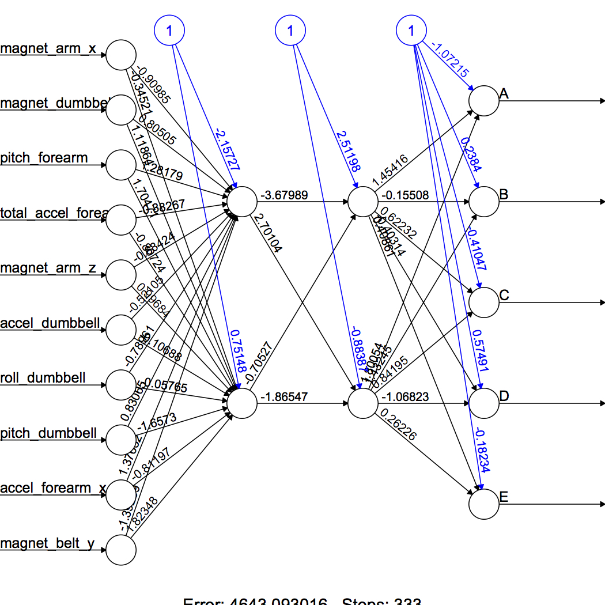

```{r setup, include=FALSE}
knitr::opts_chunk$set(echo = TRUE)
```


### Project Description

Data source: <http://groupware.les.inf.puc-rio.br/har> (har stands for human acitivity recognization; see the section on the Weight Lifting Exercise Dataset). Participants were asked to perform barbelllifts correctly and incorrectly in 5 different ways. In this project, we will be using data from accelerometers on the belt, forearm, arm, and dumbell of 6 participants to quantify how much of a particuar activity they do, and more importantly to quantify `how well they do it`. In particular, our project is to predict the manner in which they did the exercise. That is, the `classe` variable in the dataset, which is a categorical variable taking place either equal to A, B, C, D, or E.

### Getting and Cleaning Data

The training data and the test data used in the project are available here: the [training data](https://d396qusza40orc.cloudfront.net/predmachlearn/pml-training.csv) and the [test data](https://d396qusza40orc.cloudfront.net/predmachlearn/pml-testing.csv).

Import data from the URL.
```{r}
train.website <- "https://d396qusza40orc.cloudfront.net/predmachlearn/pml-training.csv"
test.website <- "https://d396qusza40orc.cloudfront.net/predmachlearn/pml-testing.csv"
```

The data contain many "NA" and "#DIV/0!" entries. We read the data onto the disk and then deal with them by using the na.strings function.
```{r}
train <- read.csv(url(train.website), na.strings=c("NA", "#DIV/0!", ""))
test <- read.csv(url(test.website), na.strings=c("NA", "#DIV/0!", ""))
```

We further remove predictors that are totally missing (all NAs) in the training set and test set.
```{r}
train <- train[, colSums(is.na(train)) == 0]
test <- test[, colSums(is.na(test)) == 0]
```

Check the dimension of training sample and test sample:
dim(train) dim(test). Both dataset have 60 columns. 
The traiing sample has 19622 observations; yet, the test sample has 20 observations.
Now, we add data.frame.
```{r}
attach(train)
```

Take a look at the data.
```{r}
str(train)
```

Since variables X, raw_timestamp_part_1, raw_timestamp_part_2, cvtd_timestamp, new_window, and num_window seem irrelevant for prediction, we drop those variables from the training sample and test sample.
```{r}
train <- train[, -c(1, 3:7)]
test <- test[, -c(1, 3:7)]
```

The final dataset have no NAs, which can be verified by using the functions colSums(is.na(train)) and colSums(is.na(test)).
After the data-cleaning process, we now have the dataset consisting of 54 columns. The last column is the outcome variable `classe`, and the remaining of the varaibles are 53 predictors. 


### Road Map of Our Analysis 

Our goal is to predict the categorical varialbe, `classe`, using 53 predictors.
We use the following machine learning algorithms:

1. classification tree
2. random forest
3. backpropagation neural network

Through the cross validation, the performance of different algorithms is evaluated,
and the parameters of model complexity are tunned. 
Specifically, we split the original training sample into (a 60-40 split) the training set and validation set. We then train machine learning algorithms. Consequently we also use the validation set to train algorithms, determine the winner, and thus overfit the model. Therefore, the evaluation should rely on an additional holdout/test sample of 20 observations. Finally we evaluate the out-of-sample performance of our algorithm by using the holdout sample.

### Training Machine Learning Algorithms

#### Load Packages

**`unified framework for doing cross validation`**
```{r results='hide'}
require(caret)
```

**`training classification trees and making fancy tree graphs`**
```{r}
require(rpart)
require(rpart.plot)
require(RColorBrewer)
require(rattle)
```

**`training random forest`**
```{r}
require(randomForest)
```

**`training artificial neural network; making class.ind(): category -> dummy`**
```{r}
require(neuralnet)
require(nnet)
```

#### Split Sample into Training and Validation Sets with a 60-40 Split
```{r}
intrain <- createDataPartition(y=train$classe, p=0.6, list=FALSE)
training <- train[intrain,]
testing <- train[-intrain,]
```

#### Classification Tree
`finding homogeneous subsets`

We estimate a classification tree and plot the resulting tree. The performance of the tree model is investigated by using the validation sample and by calculating the confusion matrix. The tree predicts the categorical variable `classe` correctly with an accuracy rate within a 95% confidence interval of (0.4754, 0.4976).

```{r}
set.seed(1713)
treeFit <- train(classe ~., data=training, preProcess=c("center","scale"), method="rpart", metric="Accuracy")
print(treeFit$finalModel)
```

Plot the tree using `fancyRpartPlot(treeFit$finalModel)` or
```{r}
plot(treeFit$finalModel, uniform=TRUE, main="Classification Tree")
text(treeFit$finalModel, use.n=TRUE, all=TRUE, cex=0.8)
```

Calculate the confusion matrix.
```{r}
treePredict <- predict(treeFit, testing)
confusionMatrix(testing$classe, treePredict)
```

#### Random Forest
`a mixture of trees: bagging + a random subset of features`

We train a random forest algorithm by using 5-fold cross validation.
The model predicts the categorical variable `classe` correctly with an impressive accuracy rate within a 95% confidence interval of (0.9863, 0.9911).
This model dominates the classification tree along many measures,
such as sensitivity and specificity; cf. the resulting confusion matrix.

```{r}
set.seed(1713)
forestFit <- train(classe ~ ., method="rf", trControl=trainControl(method="cv", number=5), data=training)
print(forestFit)

forestPredict <- predict(forestFit, testing)
confusionMatrix(testing$classe, forestPredict)
```


#### Backpropagation Neural Network
`multi-layer perceptron and learning from mistakes`

To implement the backpropagation neural network (bpn), we transform categorical variables into dummy variables and delete a non-numerical feature: username.
```{r}
training <- cbind(training, class.ind(training$classe))
dim(training) 
```

Training bpn with 2 hidden layers: 1st layer 2 node and 2nd layer 2 nodes.
```{r}
#formula.bpn <- paste(paste(names(training[c(55:59)]), collapse=" + ") , 
#                     "~", paste(names(training[-c(54:59, 1)]), collapse=" + "))

#set.seed(1713)
#bpn <- neuralnet(formula = formula.bpn, 
#                 data = training,  
#                 hidden = c(2, 2), 
#                 learningrate = 0.02, 
#                 threshold = 0.01, 
#                 stepmax = 4e5)
#plot(bpn)
#bpnPredict <- compute(bpn, testing[, 2:53])
#bpnPredict$net.result
#bpnPredict01 <- round(bpnPredict$net.result)
#bpnPredict01
```

Tune parameters: determing number of neurons in each layer
```{r}
#tune.bpn <- train(formula = formula.bpn, 
#                 data = training,  
#                 method = "neuralnet",
#                 tuneGrid = expand.grid(.layer1=c(1:4), 
#                              .layer=c(0:4), .layer3=c(0)),
#                 learningrate = 0.02, 
#                 threshold = 0.01, 
#                 stepmax = 4e5)
#tune.bpn
```

Saddly the bpn algorithm is way to difficult to converge. In most cases,it takes a couple of hours to train the model and yields unsatisfactory results.
In what follows, we provide readers with a toy example we have conducted along the way on training the bpn models. We first use the multinomial-LASSO (glmnet pacakge) to select relevant predictors. 10 of 53 predictors are seleted. We then use these 10 predictors as features in the input layer of bpn algorithms. Consequently we train a bpn model with 10 neurons in the input layers, with two hidden layers,
and with two nodes in each hidden layer. However, the resulting model performs inadequtely.

```{r}
require(glmnet)
logitLasso <- glmnet(as.matrix(training[,2:53]), as.factor(training$classe),
                     family="multinomial", 
                     lambda=0.05, alpha=1)
#coef(logitLasso)
```

10 selected preditors:
`magnet_arm_x, magnet_dumbbell_z, pitch_forearm, total_accel_forearm,`

`magnet_arm_z, accel_dumbbell_x,` 

`roll_dumbbell, pitch_dumbbell,`

`(roll_dumbbell), (pitch_forearm), accel_forearm_x,`

`magnet_belt_y`


Train the toy model.
```{r}
formula.bpn <- A + B + C + D + E ~
  magnet_arm_x + magnet_dumbbell_z + pitch_forearm + total_accel_forearm +
  magnet_arm_z + accel_dumbbell_x +
  roll_dumbbell+ pitch_dumbbell +
  accel_forearm_x +
  magnet_belt_y

set.seed(1713)
bpn <- neuralnet(formula = formula.bpn, 
                 data = training,  
                 hidden = c(2, 2), 
                 learningrate = 0.01, 
                 threshold = 0.01, 
                 stepmax = 4e5)
plot(bpn)
```

```{r echo=FALSE, out.width='65%'}

```


### Performance of Random Forest in the Test Sample

Random forest is chosen as our preferred algorithm.
We use the 20-observation test cases to evaluate its out-of-sample performance.
```{r}
forestPredict.final <- predict(forestFit, test)
print(forestPredict.final)
```

The following function generate answers to submit to the Course Project Prediction Quiz for automated grading.
```{r}
pml_write_files = function(x){
  n = length(x)
  for(i in 1:n){
    filename = paste0("problem_id_",i,".txt")
    write.table(x[i],file=filename,quote=FALSE,row.names=FALSE,col.names=FALSE)
  }
}

pml_write_files(forestPredict.final)
```


### Conclusion

We predict the categorical varialbe, `classe`, using 53 predictors.
The following machine learning algorithms are considered.

1. classification tree
2. random forest
3. backpropagation neural network (bpn)

Random forest outperforms over classification trees, as expected.
Due to scalability reason and inefficient computatioal methods we used in 
implementing the bpn algorithm, we thus chose the random forest as the winner.
Furthermore, the random forest algorithm indeed demonstrates the far superior
out-of-sample prediction performance.
