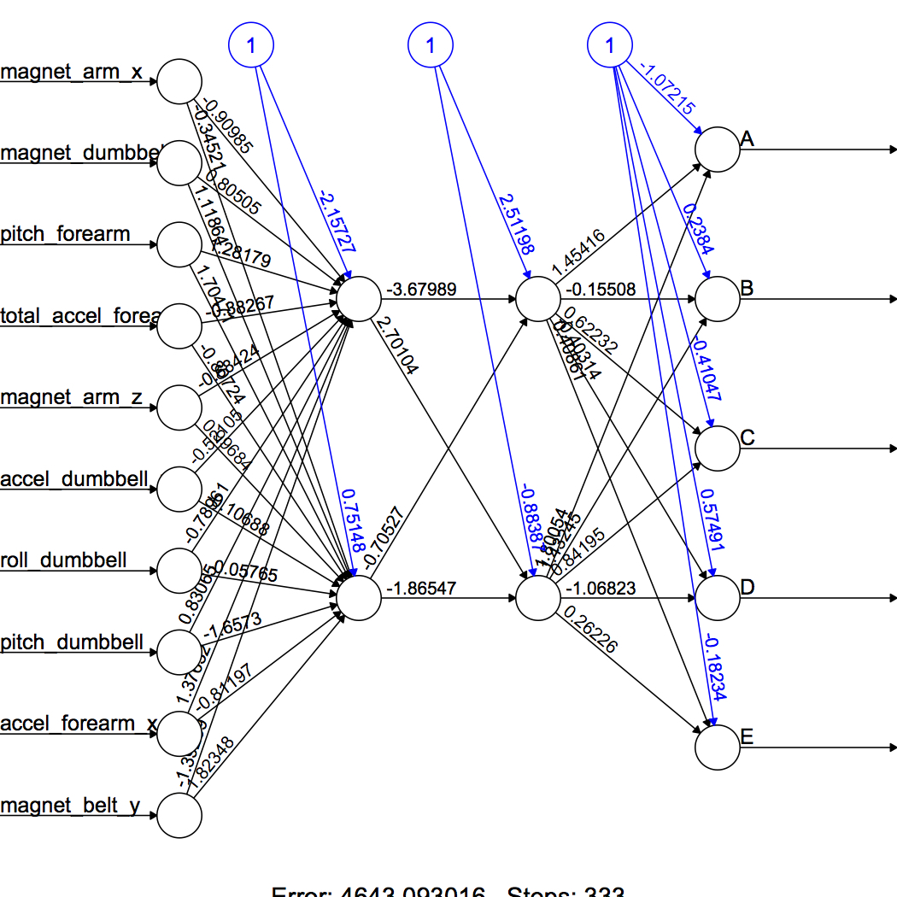

Practical Machine Learning - JHU
================
Jau-er Chen
2017/7/27

### Project Description

Data source: <http://groupware.les.inf.puc-rio.br/har> (har stands for human acitivity recognization; see the section on the Weight Lifting Exercise Dataset). Participants were asked to perform barbelllifts correctly and incorrectly in 5 different ways. In this project, we will be using data from accelerometers on the belt, forearm, arm, and dumbell of 6 participants to quantify how much of a particuar activity they do, and more importantly to quantify `how well they do it`. In particular, our project is to predict the manner in which they did the exercise. That is, the `classe` variable in the dataset, which is a categorical variable taking place either equal to A, B, C, D, or E.

### Getting and Cleaning Data

The training data and the test data used in the project are available here: the [training data](https://d396qusza40orc.cloudfront.net/predmachlearn/pml-training.csv) and the [test data](https://d396qusza40orc.cloudfront.net/predmachlearn/pml-testing.csv).

Import data from the URL.

``` r
train.website <- "https://d396qusza40orc.cloudfront.net/predmachlearn/pml-training.csv"
test.website <- "https://d396qusza40orc.cloudfront.net/predmachlearn/pml-testing.csv"
```

The data contain many "NA" and "\#DIV/0!" entries. We read the data onto the disk and then deal with them by using the na.strings function.

``` r
train <- read.csv(url(train.website), na.strings=c("NA", "#DIV/0!", ""))
test <- read.csv(url(test.website), na.strings=c("NA", "#DIV/0!", ""))
```

We further remove predictors that are totally missing (all NAs) in the training set and test set.

``` r
train <- train[, colSums(is.na(train)) == 0]
test <- test[, colSums(is.na(test)) == 0]
```

Check the dimension of training sample and test sample: dim(train) dim(test). Both dataset have 60 columns. The traiing sample has 19622 observations; yet, the test sample has 20 observations. Now, we add data.frame.

``` r
attach(train)
```

Take a look at the data.

``` r
str(train)
```

    ## 'data.frame':    19622 obs. of  60 variables:
    ##  $ X                   : int  1 2 3 4 5 6 7 8 9 10 ...
    ##  $ user_name           : Factor w/ 6 levels "adelmo","carlitos",..: 2 2 2 2 2 2 2 2 2 2 ...
    ##  $ raw_timestamp_part_1: int  1323084231 1323084231 1323084231 1323084232 1323084232 1323084232 1323084232 1323084232 1323084232 1323084232 ...
    ##  $ raw_timestamp_part_2: int  788290 808298 820366 120339 196328 304277 368296 440390 484323 484434 ...
    ##  $ cvtd_timestamp      : Factor w/ 20 levels "02/12/2011 13:32",..: 9 9 9 9 9 9 9 9 9 9 ...
    ##  $ new_window          : Factor w/ 2 levels "no","yes": 1 1 1 1 1 1 1 1 1 1 ...
    ##  $ num_window          : int  11 11 11 12 12 12 12 12 12 12 ...
    ##  $ roll_belt           : num  1.41 1.41 1.42 1.48 1.48 1.45 1.42 1.42 1.43 1.45 ...
    ##  $ pitch_belt          : num  8.07 8.07 8.07 8.05 8.07 8.06 8.09 8.13 8.16 8.17 ...
    ##  $ yaw_belt            : num  -94.4 -94.4 -94.4 -94.4 -94.4 -94.4 -94.4 -94.4 -94.4 -94.4 ...
    ##  $ total_accel_belt    : int  3 3 3 3 3 3 3 3 3 3 ...
    ##  $ gyros_belt_x        : num  0 0.02 0 0.02 0.02 0.02 0.02 0.02 0.02 0.03 ...
    ##  $ gyros_belt_y        : num  0 0 0 0 0.02 0 0 0 0 0 ...
    ##  $ gyros_belt_z        : num  -0.02 -0.02 -0.02 -0.03 -0.02 -0.02 -0.02 -0.02 -0.02 0 ...
    ##  $ accel_belt_x        : int  -21 -22 -20 -22 -21 -21 -22 -22 -20 -21 ...
    ##  $ accel_belt_y        : int  4 4 5 3 2 4 3 4 2 4 ...
    ##  $ accel_belt_z        : int  22 22 23 21 24 21 21 21 24 22 ...
    ##  $ magnet_belt_x       : int  -3 -7 -2 -6 -6 0 -4 -2 1 -3 ...
    ##  $ magnet_belt_y       : int  599 608 600 604 600 603 599 603 602 609 ...
    ##  $ magnet_belt_z       : int  -313 -311 -305 -310 -302 -312 -311 -313 -312 -308 ...
    ##  $ roll_arm            : num  -128 -128 -128 -128 -128 -128 -128 -128 -128 -128 ...
    ##  $ pitch_arm           : num  22.5 22.5 22.5 22.1 22.1 22 21.9 21.8 21.7 21.6 ...
    ##  $ yaw_arm             : num  -161 -161 -161 -161 -161 -161 -161 -161 -161 -161 ...
    ##  $ total_accel_arm     : int  34 34 34 34 34 34 34 34 34 34 ...
    ##  $ gyros_arm_x         : num  0 0.02 0.02 0.02 0 0.02 0 0.02 0.02 0.02 ...
    ##  $ gyros_arm_y         : num  0 -0.02 -0.02 -0.03 -0.03 -0.03 -0.03 -0.02 -0.03 -0.03 ...
    ##  $ gyros_arm_z         : num  -0.02 -0.02 -0.02 0.02 0 0 0 0 -0.02 -0.02 ...
    ##  $ accel_arm_x         : int  -288 -290 -289 -289 -289 -289 -289 -289 -288 -288 ...
    ##  $ accel_arm_y         : int  109 110 110 111 111 111 111 111 109 110 ...
    ##  $ accel_arm_z         : int  -123 -125 -126 -123 -123 -122 -125 -124 -122 -124 ...
    ##  $ magnet_arm_x        : int  -368 -369 -368 -372 -374 -369 -373 -372 -369 -376 ...
    ##  $ magnet_arm_y        : int  337 337 344 344 337 342 336 338 341 334 ...
    ##  $ magnet_arm_z        : int  516 513 513 512 506 513 509 510 518 516 ...
    ##  $ roll_dumbbell       : num  13.1 13.1 12.9 13.4 13.4 ...
    ##  $ pitch_dumbbell      : num  -70.5 -70.6 -70.3 -70.4 -70.4 ...
    ##  $ yaw_dumbbell        : num  -84.9 -84.7 -85.1 -84.9 -84.9 ...
    ##  $ total_accel_dumbbell: int  37 37 37 37 37 37 37 37 37 37 ...
    ##  $ gyros_dumbbell_x    : num  0 0 0 0 0 0 0 0 0 0 ...
    ##  $ gyros_dumbbell_y    : num  -0.02 -0.02 -0.02 -0.02 -0.02 -0.02 -0.02 -0.02 -0.02 -0.02 ...
    ##  $ gyros_dumbbell_z    : num  0 0 0 -0.02 0 0 0 0 0 0 ...
    ##  $ accel_dumbbell_x    : int  -234 -233 -232 -232 -233 -234 -232 -234 -232 -235 ...
    ##  $ accel_dumbbell_y    : int  47 47 46 48 48 48 47 46 47 48 ...
    ##  $ accel_dumbbell_z    : int  -271 -269 -270 -269 -270 -269 -270 -272 -269 -270 ...
    ##  $ magnet_dumbbell_x   : int  -559 -555 -561 -552 -554 -558 -551 -555 -549 -558 ...
    ##  $ magnet_dumbbell_y   : int  293 296 298 303 292 294 295 300 292 291 ...
    ##  $ magnet_dumbbell_z   : num  -65 -64 -63 -60 -68 -66 -70 -74 -65 -69 ...
    ##  $ roll_forearm        : num  28.4 28.3 28.3 28.1 28 27.9 27.9 27.8 27.7 27.7 ...
    ##  $ pitch_forearm       : num  -63.9 -63.9 -63.9 -63.9 -63.9 -63.9 -63.9 -63.8 -63.8 -63.8 ...
    ##  $ yaw_forearm         : num  -153 -153 -152 -152 -152 -152 -152 -152 -152 -152 ...
    ##  $ total_accel_forearm : int  36 36 36 36 36 36 36 36 36 36 ...
    ##  $ gyros_forearm_x     : num  0.03 0.02 0.03 0.02 0.02 0.02 0.02 0.02 0.03 0.02 ...
    ##  $ gyros_forearm_y     : num  0 0 -0.02 -0.02 0 -0.02 0 -0.02 0 0 ...
    ##  $ gyros_forearm_z     : num  -0.02 -0.02 0 0 -0.02 -0.03 -0.02 0 -0.02 -0.02 ...
    ##  $ accel_forearm_x     : int  192 192 196 189 189 193 195 193 193 190 ...
    ##  $ accel_forearm_y     : int  203 203 204 206 206 203 205 205 204 205 ...
    ##  $ accel_forearm_z     : int  -215 -216 -213 -214 -214 -215 -215 -213 -214 -215 ...
    ##  $ magnet_forearm_x    : int  -17 -18 -18 -16 -17 -9 -18 -9 -16 -22 ...
    ##  $ magnet_forearm_y    : num  654 661 658 658 655 660 659 660 653 656 ...
    ##  $ magnet_forearm_z    : num  476 473 469 469 473 478 470 474 476 473 ...
    ##  $ classe              : Factor w/ 5 levels "A","B","C","D",..: 1 1 1 1 1 1 1 1 1 1 ...

Since variables X, raw\_timestamp\_part\_1, raw\_timestamp\_part\_2, cvtd\_timestamp, new\_window, and num\_window seem irrelevant for prediction, we drop those variables from the training sample and test sample.

``` r
train <- train[, -c(1, 3:7)]
test <- test[, -c(1, 3:7)]
```

The final dataset have no NAs, which can be verified by using the functions colSums(is.na(train)) and colSums(is.na(test)). After the data-cleaning process, we now have the dataset consisting of 54 columns. The last column is the outcome variable `classe`, and the remaining of the varaibles are 53 predictors.

### Road Map of Our Analysis

Our goal is to predict the categorical varialbe, `classe`, using 53 predictors. We use the following machine learning algorithms:

1.  classification tree
2.  random forest
3.  backpropagation neural network

Through the cross validation, the performance of different algorithms is evaluated, and the parameters of model complexity are tunned. Specifically, we split the original training sample into (a 60-40 split) the training set and validation set. We then train machine learning algorithms. Consequently we also use the validation set to train algorithms, determine the winner, and thus overfit the model. Therefore, the evaluation should rely on an additional holdout/test sample of 20 observations. Finally we evaluate the out-of-sample performance of our algorithm by using the holdout sample.

### Training Machine Learning Algorithms

#### Load Packages

**`unified framework for doing cross validation`**

``` r
require(caret)
```

    ## Loading required package: caret

    ## Warning: package 'caret' was built under R version 3.3.2

    ## Loading required package: lattice

    ## Loading required package: ggplot2

    ## Warning: package 'ggplot2' was built under R version 3.3.2

**`training classification trees and making fancy tree graphs`**

``` r
require(rpart)
```

    ## Loading required package: rpart

``` r
require(rpart.plot)
```

    ## Loading required package: rpart.plot

    ## Warning: package 'rpart.plot' was built under R version 3.3.2

``` r
require(RColorBrewer)
```

    ## Loading required package: RColorBrewer

``` r
require(rattle)
```

    ## Loading required package: rattle

**`training random forest`**

``` r
require(randomForest)
```

    ## Loading required package: randomForest

    ## randomForest 4.6-12

    ## Type rfNews() to see new features/changes/bug fixes.

    ## 
    ## Attaching package: 'randomForest'

    ## The following object is masked from 'package:ggplot2':
    ## 
    ##     margin

**`training artificial neural network; making class.ind(): category -> dummy`**

``` r
require(neuralnet)
```

    ## Loading required package: neuralnet

``` r
require(nnet)
```

    ## Loading required package: nnet

#### Split Sample into Training and Validation Sets with a 60-40 Split

``` r
intrain <- createDataPartition(y=train$classe, p=0.6, list=FALSE)
training <- train[intrain,]
testing <- train[-intrain,]
```

#### Classification Tree

`finding homogeneous subsets`

We estimate a classification tree and plot the resulting tree. The performance of the tree model is investigated by using the validation sample and by calculating the confusion matrix. The tree predicts the categorical variable `classe` correctly with an accuracy rate within a 95% confidence interval of (0.4754, 0.4976).

``` r
set.seed(1713)
treeFit <- train(classe ~., data=training, preProcess=c("center","scale"), method="rpart", metric="Accuracy")
print(treeFit$finalModel)
```

    ## n= 11776 
    ## 
    ## node), split, n, loss, yval, (yprob)
    ##       * denotes terminal node
    ## 
    ##  1) root 11776 8428 A (0.28 0.19 0.17 0.16 0.18)  
    ##    2) roll_belt< 1.064566 10794 7453 A (0.31 0.21 0.19 0.18 0.11)  
    ##      4) pitch_forearm< -1.55938 991    8 A (0.99 0.0081 0 0 0) *
    ##      5) pitch_forearm>=-1.55938 9803 7445 A (0.24 0.23 0.21 0.2 0.12)  
    ##       10) magnet_dumbbell_y< 0.6687035 8313 6006 A (0.28 0.18 0.24 0.19 0.11)  
    ##         20) roll_forearm< 0.8305787 5156 3099 A (0.4 0.19 0.18 0.17 0.061) *
    ##         21) roll_forearm>=0.8305787 3157 2094 C (0.079 0.17 0.34 0.23 0.19) *
    ##       11) magnet_dumbbell_y>=0.6687035 1490  734 B (0.034 0.51 0.038 0.23 0.19) *
    ##    3) roll_belt>=1.064566 982    7 E (0.0071 0 0 0 0.99) *

Plot the tree using `fancyRpartPlot(treeFit$finalModel)` or

``` r
plot(treeFit$finalModel, uniform=TRUE, main="Classification Tree")
text(treeFit$finalModel, use.n=TRUE, all=TRUE, cex=0.8)
```


Calculate the confusion matrix.

``` r
treePredict <- predict(treeFit, testing)
confusionMatrix(testing$classe, treePredict)
```

    ## Confusion Matrix and Statistics
    ## 
    ##           Reference
    ## Prediction    A    B    C    D    E
    ##          A 2044   30  151    0    7
    ##          B  611  530  377    0    0
    ##          C  659   51  658    0    0
    ##          D  578  230  478    0    0
    ##          E  210  198  378    0  656
    ## 
    ## Overall Statistics
    ##                                           
    ##                Accuracy : 0.4955          
    ##                  95% CI : (0.4844, 0.5067)
    ##     No Information Rate : 0.5228          
    ##     P-Value [Acc > NIR] : 1               
    ##                                           
    ##                   Kappa : 0.3404          
    ##  Mcnemar's Test P-Value : NA              
    ## 
    ## Statistics by Class:
    ## 
    ##                      Class: A Class: B Class: C Class: D Class: E
    ## Sensitivity            0.4983  0.51011  0.32223       NA  0.98944
    ## Specificity            0.9498  0.85486  0.87767   0.8361  0.89057
    ## Pos Pred Value         0.9158  0.34914  0.48099       NA  0.45492
    ## Neg Pred Value         0.6334  0.91956  0.78635       NA  0.99891
    ## Prevalence             0.5228  0.13242  0.26026   0.0000  0.08450
    ## Detection Rate         0.2605  0.06755  0.08386   0.0000  0.08361
    ## Detection Prevalence   0.2845  0.19347  0.17436   0.1639  0.18379
    ## Balanced Accuracy      0.7240  0.68248  0.59995       NA  0.94001

#### Random Forest

`a mixture of trees: bagging + a random subset of features`

We train a random forest algorithm by using 5-fold cross validation. The model predicts the categorical variable `classe` correctly with an impressive accuracy rate within a 95% confidence interval of (0.9863, 0.9911). This model dominates the classification tree along many measures, such as sensitivity and specificity; cf. the resulting confusion matrix.

``` r
set.seed(1713)
forestFit <- train(classe ~ ., method="rf", trControl=trainControl(method="cv", number=5), data=training)
print(forestFit)
```

    ## Random Forest 
    ## 
    ## 11776 samples
    ##    53 predictor
    ##     5 classes: 'A', 'B', 'C', 'D', 'E' 
    ## 
    ## No pre-processing
    ## Resampling: Cross-Validated (5 fold) 
    ## Summary of sample sizes: 9420, 9421, 9421, 9421, 9421 
    ## Resampling results across tuning parameters:
    ## 
    ##   mtry  Accuracy   Kappa    
    ##    2    0.9871773  0.9837774
    ##   29    0.9893001  0.9864643
    ##   57    0.9814028  0.9764728
    ## 
    ## Accuracy was used to select the optimal model using  the largest value.
    ## The final value used for the model was mtry = 29.

``` r
forestPredict <- predict(forestFit, testing)
confusionMatrix(testing$classe, forestPredict)
```

    ## Confusion Matrix and Statistics
    ## 
    ##           Reference
    ## Prediction    A    B    C    D    E
    ##          A 2227    3    1    0    1
    ##          B    6 1506    6    0    0
    ##          C    0    6 1359    3    0
    ##          D    0    0   18 1268    0
    ##          E    0    0    4    1 1437
    ## 
    ## Overall Statistics
    ##                                           
    ##                Accuracy : 0.9938          
    ##                  95% CI : (0.9918, 0.9954)
    ##     No Information Rate : 0.2846          
    ##     P-Value [Acc > NIR] : < 2.2e-16       
    ##                                           
    ##                   Kappa : 0.9921          
    ##  Mcnemar's Test P-Value : NA              
    ## 
    ## Statistics by Class:
    ## 
    ##                      Class: A Class: B Class: C Class: D Class: E
    ## Sensitivity            0.9973   0.9941   0.9791   0.9969   0.9993
    ## Specificity            0.9991   0.9981   0.9986   0.9973   0.9992
    ## Pos Pred Value         0.9978   0.9921   0.9934   0.9860   0.9965
    ## Neg Pred Value         0.9989   0.9986   0.9955   0.9994   0.9998
    ## Prevalence             0.2846   0.1931   0.1769   0.1621   0.1833
    ## Detection Rate         0.2838   0.1919   0.1732   0.1616   0.1832
    ## Detection Prevalence   0.2845   0.1935   0.1744   0.1639   0.1838
    ## Balanced Accuracy      0.9982   0.9961   0.9889   0.9971   0.9993

#### Backpropagation Neural Network

`multi-layer perceptron and learning from mistakes`

To implement the backpropagation neural network (bpn), we transform categorical variables into dummy variables and delete a non-numerical feature: username.

``` r
training <- cbind(training, class.ind(training$classe))
dim(training) 
```

    ## [1] 11776    59

Training bpn with 2 hidden layers: 1st layer 2 node and 2nd layer 2 nodes.

``` r
#formula.bpn <- paste(paste(names(training[c(55:59)]), collapse=" + ") , 
#                     "~", paste(names(training[-c(54:59, 1)]), collapse=" + "))

#set.seed(1713)
#bpn <- neuralnet(formula = formula.bpn, 
#                 data = training,  
#                 hidden = c(2, 2), 
#                 learningrate = 0.02, 
#                 threshold = 0.01, 
#                 stepmax = 4e5)
#plot(bpn)
#bpnPredict <- compute(bpn, testing[, 2:53])
#bpnPredict$net.result
#bpnPredict01 <- round(bpnPredict$net.result)
#bpnPredict01
```

Tune parameters: determing number of neurons in each layer

``` r
#tune.bpn <- train(formula = formula.bpn, 
#                 data = training,  
#                 method = "neuralnet",
#                 tuneGrid = expand.grid(.layer1=c(1:4), 
#                              .layer=c(0:4), .layer3=c(0)),
#                 learningrate = 0.02, 
#                 threshold = 0.01, 
#                 stepmax = 4e5)
#tune.bpn
```

Saddly the bpn algorithm is way to difficult to converge. In most cases,it takes a couple of hours to train the model and yields unsatisfactory results. In what follows, we provide readers with a toy example we have conducted along the way on training the bpn models. We first use the multinomial-LASSO (glmnet pacakge) to select relevant predictors. 10 of 53 predictors are seleted. We then use these 10 predictors as features in the input layer of bpn algorithms. Consequently we train a bpn model with 10 neurons in the input layers, with two hidden layers, and with two nodes in each hidden layer. However, the resulting model performs inadequtely.

``` r
require(glmnet)
```

    ## Loading required package: glmnet

    ## Loading required package: Matrix

    ## Loading required package: foreach

    ## Loaded glmnet 2.0-5

``` r
logitLasso <- glmnet(as.matrix(training[,2:53]), as.factor(training$classe),
                     family="multinomial", 
                     lambda=0.05, alpha=1)
#coef(logitLasso)
```

10 selected preditors: `magnet_arm_x, magnet_dumbbell_z, pitch_forearm, total_accel_forearm,`

`magnet_arm_z, accel_dumbbell_x,`

`roll_dumbbell, pitch_dumbbell,`

`(roll_dumbbell), (pitch_forearm), accel_forearm_x,`

`magnet_belt_y`

Train the toy model.

``` r
formula.bpn <- A + B + C + D + E ~
  magnet_arm_x + magnet_dumbbell_z + pitch_forearm + total_accel_forearm +
  magnet_arm_z + accel_dumbbell_x +
  roll_dumbbell+ pitch_dumbbell +
  accel_forearm_x +
  magnet_belt_y

set.seed(1713)
bpn <- neuralnet(formula = formula.bpn, 
                 data = training,  
                 hidden = c(2, 2), 
                 learningrate = 0.01, 
                 threshold = 0.01, 
                 stepmax = 4e5)
plot(bpn)
```



### Performance of Random Forest in the Test Sample

Random forest is chosen as our preferred algorithm. We use the 20-observation test cases to evaluate its out-of-sample performance.

``` r
forestPredict.final <- predict(forestFit, test)
print(forestPredict.final)
```

    ##  [1] B A B A A E D B A A B C B A E E A B B B
    ## Levels: A B C D E

The following function generate answers to submit to the Course Project Prediction Quiz for automated grading.

``` r
pml_write_files = function(x){
  n = length(x)
  for(i in 1:n){
    filename = paste0("problem_id_",i,".txt")
    write.table(x[i],file=filename,quote=FALSE,row.names=FALSE,col.names=FALSE)
  }
}

pml_write_files(forestPredict.final)
```

### Conclusion

We predict the categorical varialbe, `classe`, using 53 predictors. The following machine learning algorithms are considered.

1.  classification tree
2.  random forest
3.  backpropagation neural network (bpn)

Random forest outperforms over classification trees, as expected. Due to scalability reason and inefficient computatioal methods we used in implementing the bpn algorithm, we thus chose the random forest as the winner. Furthermore, the random forest algorithm indeed demonstrates the far superior out-of-sample prediction performance.
